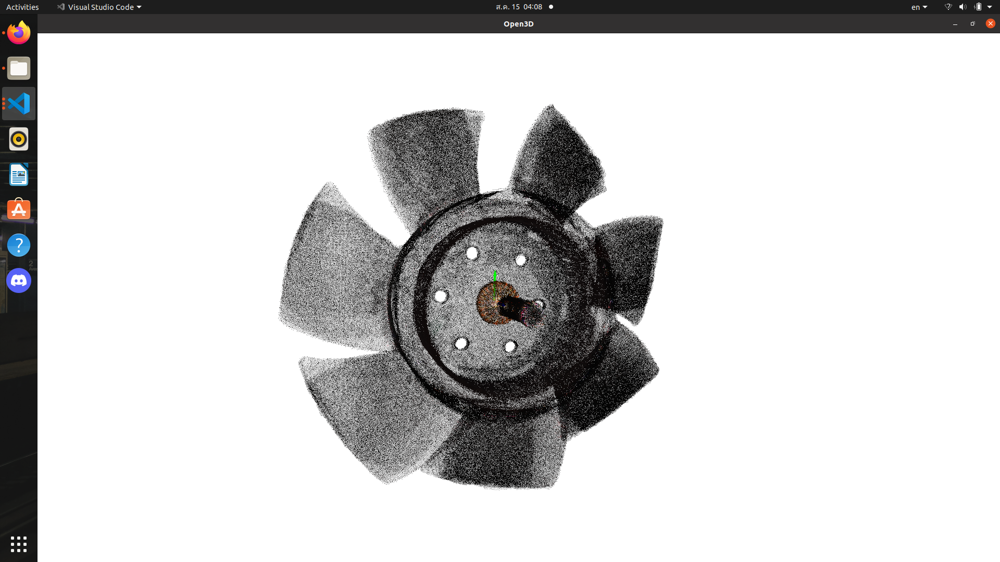
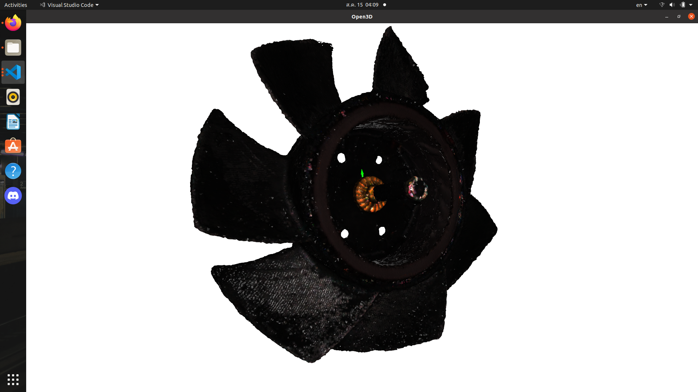
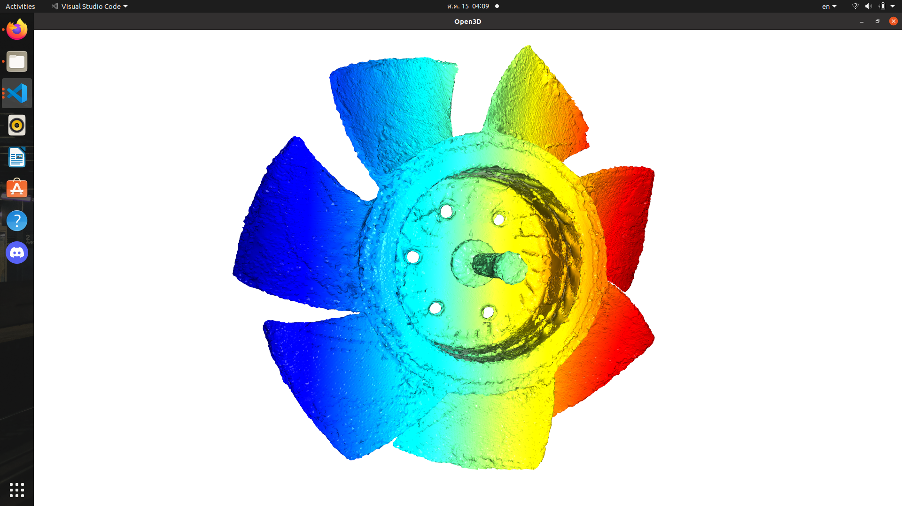
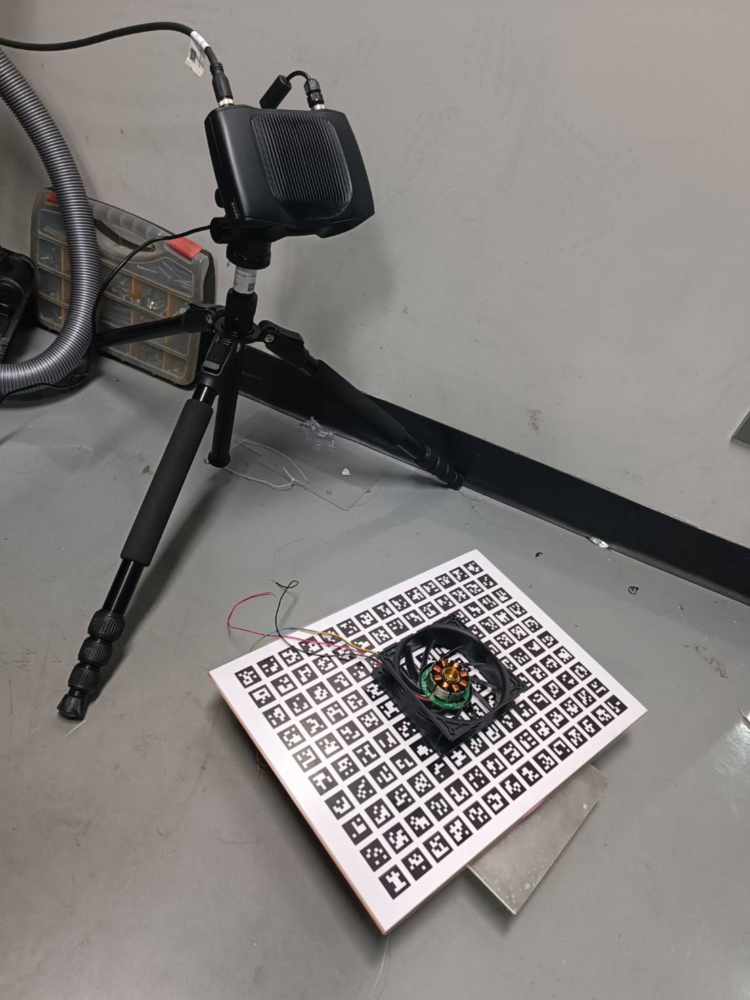
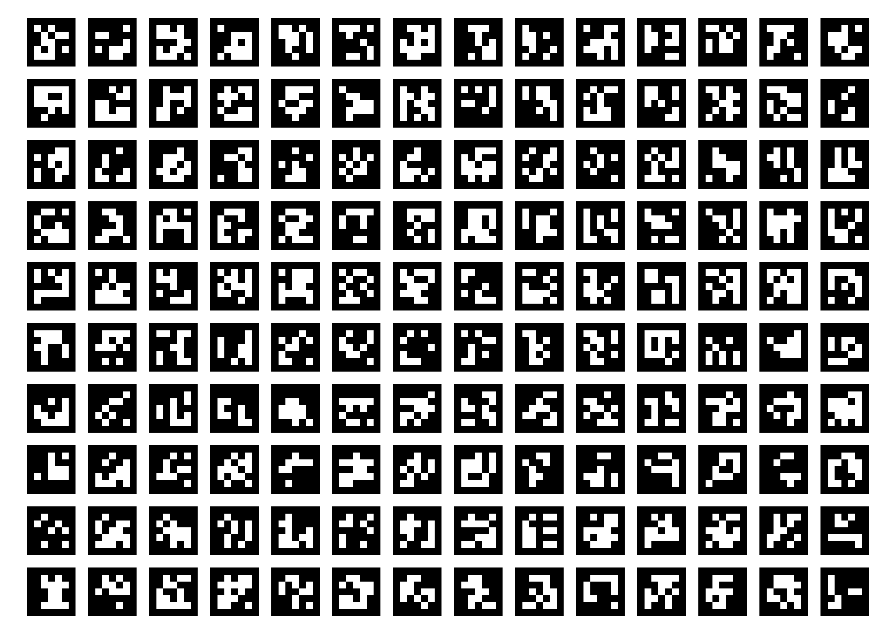

# Model3d
Scanning 3D model with ArUco Marker

  

Require zivid package https://github.com/zivid/zivid-ros


To start zivid two camera
```
roslaunch model3d zivid_run.launch
```
Set environment by put the object on the aruco marker board

 

To start scanning 3d model by zivid capturing aruco marker board
```
rosrun model3d zivid_model.py
```

# Then press the key to process
    :: Key command ::
c : Capturing & Merge Model

p : Preview pcd_merged

s : Save

e : Shutdown the Server
